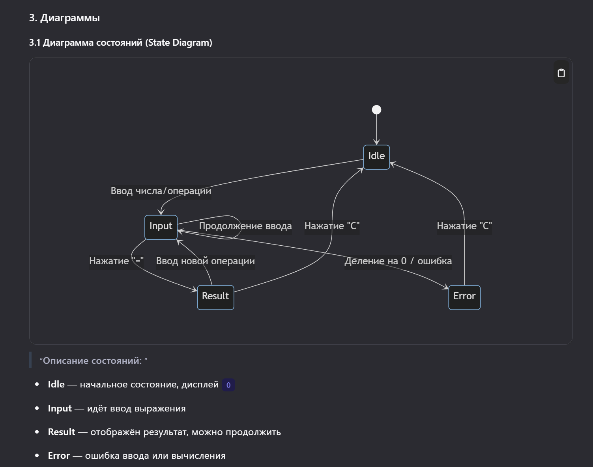
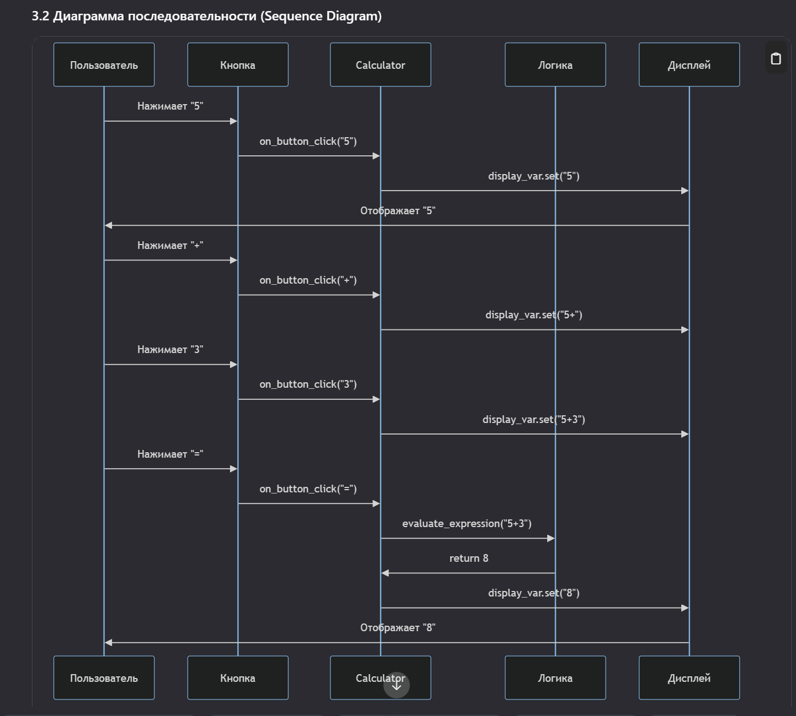
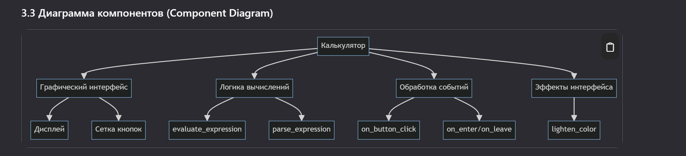

# Дополнительная документация к программному продукту  
**Программа:** Калькулятор  
**Команда:** `Сапоги`  
**Версия:** 1.0  
**Дата:** 5 сентября 2025 г.

---

## 1. Руководство пользователя

### 1.1 Назначение
Данный документ предназначен для помощи пользователю в освоении и эффективном использовании калькулятора. Программа подходит для выполнения базовых арифметических операций и работы с десятичными числами.

### 1.2 Запуск программы
1. Убедитесь, что на компьютере установлен Python 3.7 или выше.
2. Скачайте файл `calculator.py`.
3. Откройте терминал или командную строку в папке с файлом.
4. Выполните команду:
   ```bash
   python calculator.py
   ```

### 1.3 Интерфейс и управление

#### Основные элементы:
| Элемент | Функция |
|--------|--------|
| **Дисплей** | Отображает текущее выражение и результат |
| **Кнопки 0–9** | Ввод чисел |
| **Кнопка .** | Ввод десятичной точки |
| **Кнопка C** | Полная очистка дисплея и выражения |
| **Кнопки +, −, ×, ÷** | Арифметические операции |
| **Кнопка =** | Вычисление результата |

#### Примеры использования:
- **Сложение:** `5 + 3 =` → результат: `8`
- **Умножение:** `4 × 7 =` → результат: `28`
- **Деление:** `10 ÷ 2 =` → результат: `5`
- **Работа с дробями:** `0.5 + 0.25 =` → результат: `0.75`
- **Продолжение вычислений:** `5 + 3 =`, затем `+ 2 =` → результат: `10`

#### Обработка ошибок:
- При делении на ноль отображается **"Ошибка"**.
- При некорректном вводе (например, `..`) отображается **"Error"**.
- После ошибки нажмите `C`, чтобы начать заново.

---

### 1.4 Горячие клавиши (опционально)
Программа поддерживает ввод с клавиатуры:
- Цифры: `0–9`
- Операции: `+`, `-`, `*`, `/`
- Точка: `.`
- Равно: `Enter`
- Очистка: `Esc` или `Delete`

---

## 2. Архитектура системы

### 2.1 Общая структура
Калькулятор построен по принципу **MVC-подобной архитектуры** (Model-View-Controller), хотя реализован в одном классе для простоты.


### 2.2 Модули и компоненты

| Компонент | Назначение |
|---------|-----------|
| `Calculator.__init__()` | Инициализация окна, переменных, настройка геометрии |
| `create_widgets()` | Создание дисплея и сетки кнопок |
| `on_button_click(char)` | Обработка нажатий кнопок |
| `evaluate_expression()` | Парсинг и вычисление выражения с приоритетом |
| `on_enter()`, `on_leave()` | Эффекты при наведении на кнопки |
| `lighten_color()` | Утилита для визуального эффекта |

---

### 2.3 Логика вычислений
Выражение обрабатывается в три этапа:
1. **Ввод** — символы добавляются в строку `expression`.
2. **Парсинг** — строка разбивается на токены (числа и операторы).
3. **Вычисление** — применяется приоритет операций (`×`, `÷` перед `+`, `−`).

Пример:
Ввод: 2 + 3 × 4
Токены: [2, '+', 3, '×', 4]
Вычисление: 3 × 4 = 12 → 2 + 12 = 14
Результат: 14


Ключевые особенности:
- Поддержка десятичных дробей.
- Корректная обработка приоритета операций.
- Продолжение вычислений после результата.
- Защита от деления на ноль.
- Блокировка ввода нескольких точек в одном числе.

---

## 3. Требования к системе

| Параметр | Требование |
|--------|-----------|
| Операционная система | Windows, Linux, macOS |
| Python | 3.7 или выше |
| Библиотеки | tkinter (входит в стандартную поставку) |
| Память | 100 МБ свободной оперативной памяти |
| Место на диске | 1 МБ |
| Разрешение экрана | Минимум 1024×768 |

---

## 4. Поддержка и обратная связь

По вопросам, предложениям или сообщениям об ошибках обращайтесь:  
🌐 https://github.com/Relax1205/TIVPO


--- 

Вот это дополнительно, схемки выдало гпт, я не уверен, что они вообще нужны (по заданию, они не обязяательны)


